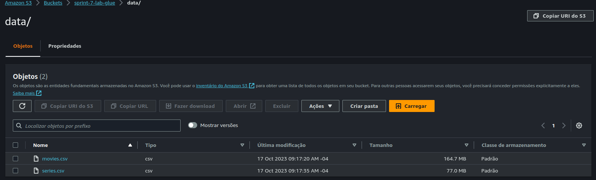

# Desafio

O desafio teve início na Sprint 7 e está sendo desenvolvido até o presente momento.

## Etapa I - ETL

O script em Python para subir os arquivos movies.csv e series.csv pode ser acessado [aqui](Desafio/etapa-1/Script.py).

O [Dockerfile](etapa-1/Dockerfile) do container.

## Etapa II - Ingestão de Dados do TMDB

A parte 2 do Desafio pode ser dividida em 5 partes:

1. Ler os dados de movies.csv e series.csv e salvá-los em JSON com no máximo 10 MB de tamanho
2. Tratar os dados dos arquivos json gerados
3. Preencher os dados 'NULL' dos arquivos com informações coletadas usando a API do TMDB
4. Salvar os arquivos atualizados em JSON, com 100 registros cada, no S3
5. Transformar esta função em uma camada do AWS Lambda

A conclusão dos primeiros quatro passos está disponível no seguinte script: [Script do Desafio](etapa-2/Desafio-2.py).
Não consegui estar concluindo o último passo.

## Etapa III - Processamento da Trusted e Refined

### Parte 1 - Processamento da Trusted
Nesta etapa, seria necessário criar um script que pudesse se conectar a API, ler os arquivos .json gerados e preencher com os dados que faltam. Porém, esta etapa foi feita na parte anterior, o que acelerou o desenvolvimento nesta. Na parte 1, foi desenvolvido um script em Python chamado [ScriptJsonToParquet](etapa-3/ScriptJsonToParquet.py) que converteu os arquivos com 100 registros .json para o formato .parquet. Após isso, foi criado um script em Python chamado [ScriptSubirS3](etapa-3/ScriptSubirS3.py) que subiu os arquivos para o S3 na pasta 'compass-uol-desafio/'. Após isso, se utilizou um segundo script Python chamado [ScriptMoverParquet](etapa-3/ScriptMoverParquet.py) para mover os arquivos .parquet para uma subpasta chamada 'trusted/'.

### Parte 2 - Modelagem de dados da Refined

Nesta etapa, criou-se um modelo dimensional para a Refined, organizando os dados das tabelas movies.csv e series.csv. O modelo dimensional está disponível no formato SQL no arquivo [modeloDimensional.sql](etapa-3/modeloDimensional.sql).

### Parte 3 - Processamento da Refined

Para conseguir criar arquivos correspondentes aos dados desejados como tabelas na Refined, após definir o modelo, foram executados 3 jobs no AWS Glue para filtrar os dados da Trusted e os salvar em arquivos .parquet com todos os dados desejados.

- Para criar a tabela DimAtor foi utilizado o Job [DimAtor.py](etapa-3/DimAtor.py);
- Para criar a tabela DimObra foi utilizado o Job [DimObra.py](etapa-3/DimObra.py);
- Para criar a tabela FatosPersonagem foi utilizado o Job [FatosPersonagem.py](etapa-3/FatosPersonagem.py);

### Etapa IV - Apresentação do Dashboard

No dia 02 de novembro de 2023, assisti o vídeo [O Fim da Disney](https://www.youtube.com/watch?v=JAg7OQq9vpA) do canal [IMPERA](https://www.youtube.com/@RenatoIMPERA), onde ele comenta sobre a história da Disney, sua ascensão e declínio. O vídeo me impressionou muito por sua qualidade técnica e por toda a busca que foi feita, o que acabou me despertando a curiosidade de pesquisar mais e analisar sobre a influência da Disney no mercado de animações. As perguntas que eu me propus a responder foram:

1. Após o primeiro filme de animação da Disney (Branca de Neve), qual foi a reação do mercado de animações em termos de produções?
2. Como foi a recepção pública dos filmes em animação em comparação com os outros gêneros de filmes?
3. As outras empresas de filmes já produziam filmes animados?
4. A Disney influenciou o mercado de filmes de animações? Como?

Após definir as perguntas e questionamentos, foi iniciado a coleta de dados necessários para o desenvolvimento do Dashboard. O primeiro passo foi criar uma coluna "produtora", para receber as informações das produtoras de filmes e séries de comédia e animação. Após isso, tratar estes dados e prepará-los para a análise. Para fazer isso, conectei a API do TMDB com o arquivo [movies.csv](https://challenger-uol.s3.amazonaws.com/raw/movies.csv), presente na minha [raw](https://challenger-uol.s3.amazonaws.com/raw/) mandei criar uma nova coluna chamada 'produtora' e inserir os dados das produtoras de todos os filmes e salvei o arquivo em minha [trusted](https://challenger-uol.s3.amazonaws.com/trusted/), junto dos arquivos atualizados dos meus Jsons. Após isto, excluí as informações desnecessárias do csv e mandei atualizar meus arquivos Json com os dados dos filmes de animação e criei arquivos em .parquet a partir destes .json. Salvei estes resultados na minha [refined](https://challenger-uol.s3.amazonaws.com/trusted/). 
Para atualizar o csv, foram usados os scripts presentes na pasta [etapa-4](etapa-4/). O arquivo [1FiltrarDados.py](etapa-4/1FiltrarDados.py) filtra os dados desejados, que são os filmes de animação, do arquivo movies.csv, o script [2RemoverColuna.py](etapa-4/2RemoverColuna.py) remove as colunas que não serão usadas no restante do processo, enquanto o script [3RemoveLinhas.py](etapa-4/3RemoveLinhas.py) remove as linhas duplicadas presentes no arquivo. Após isto, o script [4insereProdutora](etapa-4/4insereProdutora) insere um '|' no final de cada linha, para que eu abra o arquivo e crie uma nova coluna 'produtora'. Por fim, o script [5insereDadosGerais](etapa-4/5insereDadosGerais) insere os dados buscados pela API no nosso arquivo csv. Após renomear o arquivo e apagar os arquivos intermediários, o resultado final é o arquivo [animation_movies.csv](etapa-4/animation_movies.csv), que após ser convertido para [animation_movies.xlsx](etapa-4/animation_movies.xlsx) foi utilizado no desenvolvimento do [Dashboard](etapa-4/Dashboard.pdf) no AWS Quicksight.
