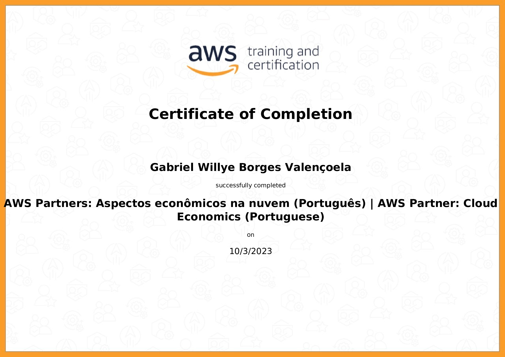

# D&A - AWS [Compass.UOL](https://compass.uol/pt/home/?utm_source=google-ads&utm_medium=ppc&utm_campaign=compasso-uol-institucional&utm_term=compass+uol): Sobre mim

**Olá, meu nome é Gabriel Willye**
**🏡Cidade: [Campo Grande/MS](https://www.google.com.br/maps/place/Campo+Grande,+MS/@-20.6258611,-54.8465322,10z/data=!3m1!4b1!4m6!3m5!1s0x9486f3f8b2834447:0xa35a7db8b968e5fd!8m2!3d-20.6281521!4d-54.5218074!16s%2Fg%2F11rgdh3sd7?entry=ttu)**
**🏫Instituição de ensino: [Universidade Federal de Mato Grosso do Sul (UFMS)](https://www.ufms.br/)**
**👨‍🎓Curso e semestre atual: Sistemas de Informação - quarto semestre**

## Experiências na área de tecnologia

Estou no momento em meu primeiro emprego formal na área de Tecnologia, como estagiário da Compass UOL.

Sou animado e extrovertido, fazendo meus projetos e tarefas com muita animação e dedicação. Gosto de ensinar e de coordenar tarefas, me dando muito bem em tarefas com gestão e colaboração entre pessoas. Sou dedicado e amo trabalhos em que posso discorrer, fazer apresentações e demonstrar meus conhecimentos. Acima de tudo, gosto de aprender e ensinar, e acredito que tenho muitas possibilidades para isso ao longo de minha jornada.

## Hobbies

Meus hobbies principais giram em torno de ouvir músicas (minha playlist no [Spotify](https://open.spotify.com/playlist/60y6pGtZ0K207UEY6QipqZ?si=4da97c4284724c35)), ler livros e estudar conteúdos que não são diretamente relacionados com minha carreira, como filosofia, sociologia, psicologia, teologia e história. Estou estudando inglês e pretendo também aprender russo.
O restante do meu tempo livre eu normalmente passo envolvido com atividades de minha igreja (sou Adventista do Sétimo Dia), como professor da Escola Sabatina, Sonoplastia e Comunicação, e também instrutor no Clube de Desbravadores de uma classe com crianças de 13 anos.

## Sprint 1 - Markdown, Git e Linux

Ser ágil faz parte da cultura da Compass, mas afinal, o que é ser ágil? Esta primeira seção da trilha foi reservada para descobrir, estudar e compreender alguns conceitos que giram em torno disso. Uma das tecnologias mais essenciais para manter as coisas em ordem, e que é essencial para o sucesso de projetos que envolvem codificação, é o versionamento de código. E, quando se estuda versionamento, muitos dos comandos utilizados são baseados no Sistema Operacional Linux. Assim sendo, nesta primeira sprint, foram estudados sobre o que são e como funcionam Metodologias Ágeis, o que é versionamento de código e como o utilizar através do Git, assim como o sistema operacional Linux, seus principais comandos e configurações.

Nesta sprint, conceitos de Metodologia Ágil, Gerência de Projetos, SCRUM, Kanban, Spotify Squads (que é bem semelhante ao modo de trabalho da Compass UOL), Design Sprint Google, S.M.A.R.T., Gestão Lean, assim como ferramentas como o Trello e a Asana, Storyboards, Mapas de Empatia, foram aprendidos. Além disso, também foram estudados o funcionamento de um Sistema Operacional Linux, os principais comandos do terminal e como configurar um espaço para desenvolvimento. Por último, foi visto como funciona o versionamento de código através do Git na plataforma do GitHub.

### Sprint 1 - Exercícios

[Exercício 1](Sprint_1/exercicios/ex1.md)  
[Exercicio 2](Sprint_1/exercicios/ex2.md)  
[Exercicio 3](Sprint_1/exercicios/ex3.md)  
[Exercicio 4](Sprint_1/exercicios/ex4.md)

### Sprint 1 - Evidências

Foram desenvolvidos resumos sobre o estudado em cada curso, e estão disponíveis para acesso em Notion.so. No arquivo "Resumos.txt" está anexado o link, e os links  dos resumos dos cursos estão disponíveis aqui também:

* [Resumo do curso de Git](https://gabrielwillye.notion.site/gabrielwillye/Comandos-Git-7f64ad1cb110467bb12d9ffc79396d9a)
* [Resumo do curso de Linux](https://gabrielwillye.notion.site/gabrielwillye/Comandos-Linux-1f45ebb40fdc47b49a16f798aa6bfd04)
* [Resumo do curso de Metodologia Ágil](https://gabrielwillye.notion.site/gabrielwillye/Metodologias-geis-45da3933fdcd43d79e5915fc6fb57228)

No final do curso de Linux é apresentado um projeto chamado LAMP, para a instalação no Linux do Apache, MySQL e PHP, ensinando também a instalação do Sublime. O projeto finalizava com dois códigos para exibir os dados das tabelas do MySQL no localhost/index.php.

[conn.php](Sprint_1/evidencias/conn.php)

[index.php](Sprint_1/evidencias/index.php)

Alguns exemplos de comandos utilizados para subir o repositório utilizando comandos Git, sendo exibidos pelo comando history:

   [Comandos Git](Sprint_1//evidencias/Git.png)

Portólio criado no projeto do curso de Git:

   [Portfolio do Curso de Git](Sprint_1/evidencias/PrintPortfolio.png)

### Sprint 1 - Certificados

## Sprint 2 - Linguagem SQL e conceitos básicos da área de Dados

Dados são, por muitos, considerados como o recurso mais valioso de nosso século. A cada segundo, uma quantidade absurda de dados é produzida, fazendo com que sejam necessários utilizar formas de controlar, acessar e utilizar estes dados de uma maneira prática e realista. Nesa sprint, foram estudados conceitos sobre Big Data e como este grandioso volume de dados, que são partes do nosso dia-a-dia, funcionam, assim como fazer análises e tratamentos de dados quando consideramos bancos de dados relacionais, que operam com um volume de dados  relativamente menor que o estudado no curso de Big Data.

### Sprint 2 - Exercícios

Nesta Sprint tivemos dois casos de estudo: Biblioteca e Loja.

#### Caso de Estudo "Biblioteca"

[Exercício 1](Sprint_2/exercicios/ex1.sql)

[Exercício 2](Sprint_2/exercicios/ex2.sql)

[Exercício 3](Sprint_2/exercicios/ex3.sql)

[Exercício 4](Sprint_2/exercicios/ex4.sql)

[Exercício 5](Sprint_2/exercicios/ex5.sql)

[Exercício 6](Sprint_2/exercicios/ex6.sql)

[Exercício 7](Sprint_2/exercicios/ex7.sql)

#### Caso de Estudo "Loja"

[Exercício 8](Sprint_2/exercicios/ex8.sql)

[Exercício 9](Sprint_2/exercicios/ex9.sql)

[Exercício 10](Sprint_2/exercicios/ex10.sql)

[Exercício 11](Sprint_2/exercicios/ex11.sql)

[Exercício 12](Sprint_2/exercicios/ex12.sql)

[Exercício 13](Sprint_2/exercicios/ex13.sql)

[Exercício 14](Sprint_2/exercicios/ex14.sql)

[Exercício 15](Sprint_2/exercicios/ex15.sql)

[Exercício 16](Sprint_2/exercicios/ex16.sql)

#### Exportação de Dados

[Exportação de Dados 1](Sprint_2/exercicios/exportacao1.csv)

[Exportação de Dados 2](Sprint_2/exercicios/exportacao2.csv)

### Sprint 2 - Evidencias

Foram desenvolvidos resumos sobre o estudado em cada curso, e estão disponíveis para acesso em Notion.so. No arquivo "Resumos.txt" está anexado o link, e os links  dos resumos dos cursos estão disponíveis aqui também:

* [Resumo do curso de SQL para Análise de Dados](https://gabrielwillye.notion.site/SQL-para-An-lise-de-Dados-c3292e791c4c422a85b7be54c7c4f1b6?pvs=4)
* [Resumo do curso de Big Data](https://gabrielwillye.notion.site/Fundamentos-de-Big-Data-79a06f2c95214628a5e1a884cb6ce161?pvs=4)

### Sprint 2 - Certificados

## Sprint 3 - Python

Uma das linguagens mais populares da atualidade e que possui uma ampla utilidade em projetos de dados, dominar o Python é essencial para quem segue carreira em Data Science. Nesta sprint, foi estudado de maneira intensiva a respeito de o que é o Python, como funciona, suas características e como utilizar suas ferramentas e recursos na carreira de Data & Analytics.

### Sprint 3 - Exercícios

Nesta Sprint, tivemos dois blocos de exercícios em Python:

#### Python I - 1/2

[Exercício 1](Sprint_3/exercicios/ex1.py)

[Exercício 2](Sprint_3/exercicios/ex2.py)

[Exercício 3](Sprint_3/exercicios/ex3.py)

[Exercício 4](Sprint_3/exercicios/ex4.py)

[Exercício 5](Sprint_3/exercicios/ex5.py)

#### Python 1 - 2/2

[Exercício 6](Sprint_3/exercicios/ex6.py)

[Exercício 7](Sprint_3/exercicios/ex7.py)

[Exercício 8](Sprint_3/exercicios/ex8.py)

[Exercício 9](Sprint_3/exercicios/ex9.py)

[Exercício 10](Sprint_3/exercicios/ex10.py)

[Exercício 11](Sprint_3/exercicios/ex11.py)

[Exercício 12](Sprint_3/exercicios/ex12.py)

[Exercício 13](Sprint_3/exercicios/ex13.py)

[Exercício 14](Sprint_3/exercicios/ex14.py)

[Exercício 15](Sprint_3/exercicios/ex15.py)

[Exercício 16](Sprint_3/exercicios/ex16.py)

[Exercício 17](Sprint_3/exercicios/ex17.py)

[Exercício 18](Sprint_3/exercicios/ex18.py)

[Exercício 19](Sprint_3/exercicios/ex19.py)

[Exercício 20](Sprint_3/exercicios/ex20.py)

#### Python II - 1/2

[Exercício 21](Sprint_3/exercicios/ex21.py)

[Exercício 22](Sprint_3/exercicios/ex22.py)

[Exercício 23](Sprint_3/exercicios/ex23.py)

[Exercício 24](Sprint_3/exercicios/ex24.py)

[Exercício 25](Sprint_3/exercicios/ex25.py)

#### Python II - 2/2

[Etapa 1 - Desafio - ETL com Python](Sprint_3/exercicios/Desafio/etapa-1.txt)

[Etapa 2 - Desafio - ETL com Python](Sprint_3/exercicios/Desafio/etapa-2.txt)

[Etapa 3 - Desafio - ETL com Python](Sprint_3/exercicios/Desafio/etapa-3.txt)

[Etapa 4 - Desafio - ETL com Python](Sprint_3/exercicios/Desafio/etapa-4.txt)

[Etapa 5 - Desafio - ETL com Python](Sprint_3/exercicios/Desafio/etapa-5.txt)

### Sprint 3 - Evidências

Foi desenvolvido um caderno de códigos com alguns desafios propostos em aula. Além disso, nele também está contido o código fonte utilizado para completar o Desafio:

* [Caderno de Códigos](Sprint_3/evidencias/Notas%20Do%20Curso.ipynb)

### Sprint 3 - Certificados

## Sprint 4 - Paradigma Funcional(Python) e Containers

Neste Sprint, aprendemos formas de como utilizar a Programação Funcional, um paradigma muito utilizado, e Docker, uma tecnologia para administrar containers (Containers são projetos que permitem criar um ambiente de desenvolvimento isolado e compartilhar este ambiente com outras pessoas). Além disso, estudamos tecnologias e métodos estatísticos, que juntos do Python, formam um conjunto extremamente útil e otimizado para a área de Data & Analytics.

### Sprint 4 - Exercícios

#### Programação Funcional

[Exercício 1](Sprint_4/exercicios/ex1.py)

[Exercício 2](Sprint_4/exercicios/ex2.py)

[Exercício 3](Sprint_4/exercicios/ex3.py)

[Exercício 4](Sprint_4/exercicios/ex4.py)

[Exercício 5](Sprint_4/exercicios/ex5.py)

#### Exercício Docker

[Desafio Docker](Sprint_4/exercicios/DesafioDocker/)

### Sprint 4 - Evidências

[Link do resumo do curso de Docker](https://gabrielwillye.notion.site/Docker-4beb4a3cf3374fa99f6cd06bcee3531c?pvs=4)

[Link do resumo do curso de Estatística Descritiva com Python](https://gabrielwillye.notion.site/Estat-stica-Descritiva-com-Python-ee1d1dae1abe4696bb1473b55a75aaad?pvs=4)

[Caderno de Exercícios - Curso de Estatistica](Sprint_4/evidencias/Estatistica.ipynb)

### Sprint 4 - Certificados

## Sprint 5 - Fundamentos de Computação em Nuvem (AWS)

Nesta Sprint começamos a estudar os fundamentos da Computação em Nuvem com foco em Amazon Web Services e sua tecnologia. Estudamos conteúdos que nos auxiliam a compreender o que é a AWS, como funcionam algumas tecnologias deles e outros conteúdos que nos auxiliam a aprender e se preparar para a Certificação Cloud Pratictioner.

### Sprint 5 - Exercícios

Não tivemos exercícios nesta Sprint

### Sprint 5 - Evidências

[Resumo do curso de AWS Partner: Sales Accreditation](https://gabrielwillye.notion.site/AWS-Sales-Accreditation-498f1ef430a3482ab7c039a0b80d4f28?pvs=4)

[Resumo do curso de AWS Partner: Accreditation](https://gabrielwillye.notion.site/AWS-Accreditation-afbd292cebef4674a537d4b0db70f919?pvs=4)

[Resumo do curso de AWS Partner: Cloud Economics Accreditation](https://gabrielwillye.notion.site/AWS-Cloud-Economics-Accreditaion-365d5273eaf6475fbbfd2bcec47de53a?pvs=4)

### Sprint 5 - Certificados

## Sprint 6 - Serviços Analíticos (AWS)

Nesta Sprint, foram estudadas as ferramentas e técnicas disponibilizadas pela Amazon Web Services para serviços de Data & Analytics. Além disso, foram executados exercícios práticos para aprofundar e treinar os conceitos estudados.

## Exercícios

### Laboratório AWS S3

### Laboratório AWS Athena

### Laboratório AWS Lambda

### Laboratório AWS - Limpeza de recursos

## Evidências

[Resumo do curso de AWS Kinesis Analytics](Sprint_6/evidencias/AmazonKinesisAnalytics.md)
[Resumo do curso de AWS Partner: Data Analytics on AWS - Business](Sprint_6/evidencias/DataAnalytics.md)
[Resumo do curso de AWS Partner: Data Analytics Fundamentals](Sprint_6/evidencias/DataAnalyticsFundamentals.md)
[Resumo do curso Amazon Kinesis Streams](Sprint_6/evidencias/AmazonKinesisStreams.md)
[Resumo do curso Amazon Elastic MapReduce](Sprint_6/evidencias/AmazonEMR.md)
[Resumo do curso Amazon Athena](Sprint_6/evidencias/AmazonAthena.md)
[Resumo do curso Amazon Quicksight](Sprint_6/evidencias/AmazonQuicksight.md)
[Resumo do curso AWS IoT Analytics](Sprint_6/evidencias/IoTAnalytics.md)
[Resumo do curso Getting Started with Amazon Redshift](Sprint_6/evidencias/AmazonRedshift.md)
[Resumo do curso Deep Dive into Concepts and Tools for Analyzing Streaming Data](Sprint_6/evidencias/DeepDive.md)
[Resumo do curso Best Practices for Data Warehousing with Amazon Redshift](Sprint_6/evidencias/DataWarehousing.md)
[Resumo do curso Serverless Analytics](Sprint_6/evidencias/ServerlessAnalytics.md)
[Resumo do curso Why Analytics for Games](Sprint_6/evidencias/AnalyticsGames.md)

## Certificados

## Sprint 7 - Plataformas Big Data (Spark, Hadoop)

**Em breve...**

## Sprint 8 -  Apache Spark

**Em breve...**

## Sprint 9 - Apache Spark

**Em breve...**

## Sprint 10 - Visualização de Dados

**Em breve...**
