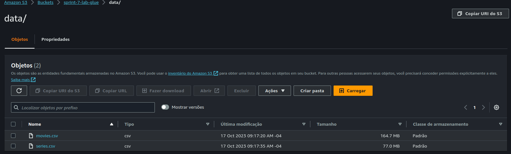

# Sprint 7 - Plataformas Big Data (Spark, Hadoop)

Nesta Sprint, foi iniciado o desenvolvimento do Desafio Final, além de se estudar e entender os conceitos por trás do HDSF, ou Hadoop Distributed File System, além de conhecer e entender o funcionamento prático do Spar, uma das ferramentas mais poderosas no processamento e transformação de dados.

## Sprint 7 - Exercícios

### Tarefa 1 - Python com Pandas e Numpy

Os códigos foram executados em .ipynb, em um Notebook no Jupyter Notebooks. Os códigos e respostas podem ser acessados [clicando aqui](exercicios/Exercício-1.ipynb).

### Tarefa 2 - Apache Spark - Contador de Palavras

O Exercício solicita que seja criado um container com a imagem jupyter/spark. Este container então deve levantar um notebook Jupyter e executar, utilizando docker exec, um algoritmo no pyspark que leia a quantidade de palavras iguais no README.md deste repositório.
O comando utilizado para criar o container foi:
**sudo docker run -it -p 8888:8888 --name jupyter_001 jupyter/all-spark-notebook**
Os prints da execução do Jupyter em funcionamento:

O log final pode ser visto no documento abaixo:

[Log_Exercício2.txt](exercicios/Log_Exercício2.txt)

### Laboratório - AWS Glue

O print de conclusão deste exercício está disponível logo abaixo:

[Script do Job](/exercicios/Script_Job.txt)

### Desafio - Parte I - ETL

O script em Python para subir os arquivos [movies.csv](exercicios/movies.csv) e [series.csv](exercicios/series.csv) pode ser acessado [aqui](exercicios/Script.py).

O [Dockerfile](exercicios/Dockerfile) do container.

## Sprint 7 - Evidências

[Resumo do curso de Hadoop](evidencias/Hadoop.md)

[Resumo do curso Formação Spark com Pyspark](evidencias/Spark.md)

## Sprint 7 - Certificados

## D&A - AWS [Compass.UOL](https://compass.uol/pt/home/?utm_source=google-ads&utm_medium=ppc&utm_campaign=compasso-uol-institucional&utm_term=compass+uol): Sobre mim

**Olá, meu nome é Gabriel Willye**
**🏡Cidade: [Campo Grande/MS](https://www.google.com.br/maps/place/Campo+Grande,+MS/@-20.6258611,-54.8465322,10z/data=!3m1!4b1!4m6!3m5!1s0x9486f3f8b2834447:0xa35a7db8b968e5fd!8m2!3d-20.6281521!4d-54.5218074!16s%2Fg%2F11rgdh3sd7?entry=ttu)**
**🏫Instituição de ensino: [Universidade Federal de Mato Grosso do Sul (UFMS)](https://www.ufms.br/)**
**👨‍🎓Curso e semestre atual: Sistemas de Informação - quarto semestre**

## Experiências na área de tecnologia

Estou no momento em meu primeiro emprego formal na área de Tecnologia, como estagiário da Compass UOL.

Sou animado e extrovertido, fazendo meus projetos e tarefas com muita animação e dedicação. Gosto de ensinar e de coordenar tarefas, me dando muito bem em tarefas com gestão e colaboração entre pessoas. Sou dedicado e amo trabalhos em que posso discorrer, fazer apresentações e demonstrar meus conhecimentos. Acima de tudo, gosto de aprender e ensinar, e acredito que tenho muitas possibilidades para isso ao longo de minha jornada.

## Hobbies

Meus hobbies principais giram em torno de ouvir músicas (minha playlist no [Spotify](https://open.spotify.com/playlist/60y6pGtZ0K207UEY6QipqZ?si=4da97c4284724c35)), ler livros e estudar conteúdos que não são diretamente relacionados com minha carreira, como filosofia, sociologia, psicologia, teologia e história. Estou estudando inglês e pretendo também aprender russo.
O restante do meu tempo livre eu normalmente passo envolvido com atividades de minha igreja (sou Adventista do Sétimo Dia), como professor da Escola Sabatina, Sonoplastia e Comunicação, e também instrutor no Clube de Desbravadores de uma classe com crianças de 13 anos. Além disso, atuo também como membro voluntário do Programa de Educação e Tutoria Sistemas em minha universidade e sou o representante discente do curso de Sistemas de Informação.
