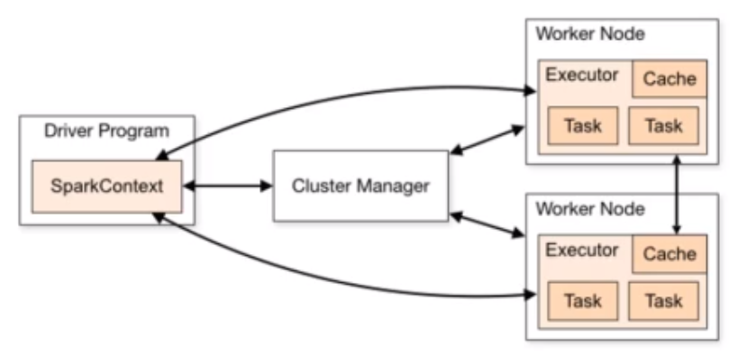
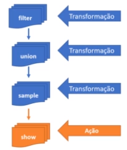

# Formação Spark com Pyspark: O Curso Completo

## Introdução

O Spark é uma ferramenta com alta performance de processamento de dados. O Spark é distribuído em cluster. É veloz e escalável, e utiliza dados em HDFS ou Cloud. O Spark copia os dados entre os nós de seu cluster, concedendo uma tolerância a falhas. Pode-se também particionar os dados em nós diferentes, concedendo maior velocidade de processamento e uma alta performance.
A estrutura do Spark é composta por um Driver, um Manager e um Executer.
**Driver:** Inicializa o SparkSession, solicita recursos computacionais do Cluster Manager, transforma as operações em DAGs e as distribui pelos executers;
**Manager:** Gerencia os recursos do cluster. Existem quatro Managers possíveis: *built-in standalone, YARN, Mesos e Kubernetes*;0
**Executer:** roda em cada nó do cluster executando as tarefas

**O principal elemento do Spark é o Data Frame.** O data frame é imutável, e cada transformação gera um novo data frame. O processamento de transformação só ocorre quando há uma ação: a **Lazy Evaluation**.

Existem dois tipos de transformação: Narrow e Wide
**Narrow:** Os dados necessários estão na mesma partição
**Wide:** Os dados necessários estão em mais de uma partição

Componentes do Spark:

* Job: Tarefa
* Stage: Divisão do Job
* Task: Menor unidade de trabalho. Uma por núcleo e por partição.

**SparkContext:** Conexão transparente com o Cluster
**SparkSession:** Acesso ao SparkContext

Você cria um script no pyspark, e o Spark cria uma sessão automaticamente chamada spark

Na hora de criar uma aplicação spark, é necessário criar um objeto

### Formatos de Big Data

Armazéns de Dados Clássicos armazenavam os dados em formatos proprietários, ou seja, qualquer ferramenta que desejasse acessar este dado precisava de um driver.
Armazéns de Dados Modernos armazenam os dados em formatos abertos, então não é necessário utilizar drivers para acessar estes dados. Estes dados estão desacoplados, binários e compactados.
Formatos principais de dados para BigData: Parquet, Avro e Orc.
Estes formatos de dados suportam schemas e podem ser particionados entre discos, fazendo consultas em paralelismo.
*Parquet* - Colunar, padrão do Spark
*ORC* - Colunar, padrão do Hive
*Avro* - Linha

Em geral, ORC é mais eficiente na criação e compressão
Parquet tem uma performance melhor na consulta, mas exige mais espaço
O ideal é fazer um benchmark.

## DataFrames e RDDs

### RDD: Resilient Distributed Datasets

* Estrutura básica de baixo nível;
* Dados "imutáveis", distribuídos pelo cluster
* Em memória;
* Pode ser persistindo em disco;
* Tolerante a falha;
* Operações sobre um RDD criam um novo RDD
  
* Estrutura de baixo nível
* Complexo e verboso
* Otimização difícil pelo Spark

-> Dataset Distribuído e Resiliente

### Dataset e DataFrame

Semelhantes a uma tabela de banco de dados, compatíveis com outros objetos. O Dataset só está disponível em Java.

#### Dataframe

* Tabelas com linhas e colunas
* Imutável
* Com schema definido
* Linguagem preservada
* Colunas podem possuir tipos diferentes
